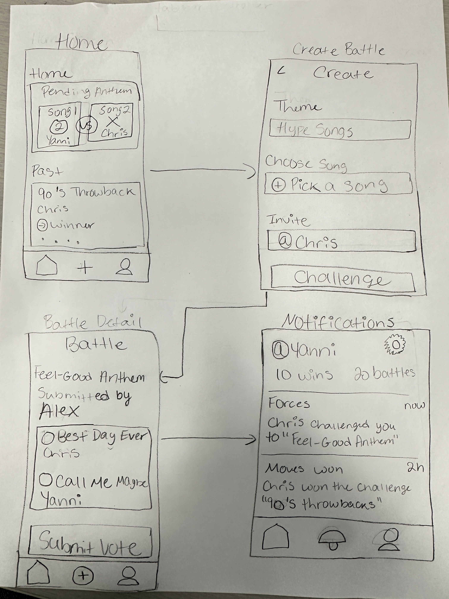

# SongRate

## Table of Contents

1. [Overview](#Overview)
2. [Product Spec](#Product-Spec)
3. [Wireframes](#Wireframes)
4. [Schema](#Schema)

## Overview

### Description

A music battle app where you and a friend each pick a song for a theme, and others vote on the best choice.

### App Evaluation

[Evaluation of your app across the following attributes]
- **Category:** Entertainment & Music
- **Mobile:** Relies on features like audio playback, push notifications, and real-time interaction, all of which are difficult to replicate well in a web-based environment. It can also integrate with Apple Music or Spotify APIs to pull in song previews, making the experience fluid and native to the mobile platform.
- **Story:** The app turns playlists into playful battles, giving users a reason to engage daily with friends or strangers in fun, low-stakes challenges. It’s highly shareable and would likely generate excitement among peers, especially within music-loving social circles.
- **Market:** The market for this app is broad and vibrant, including music fans, playlist curators, and social gamers. The app offers huge value to a niche group—those who enjoy expressing themselves through music and comparing tastes.
- **Habit:** This app can become habit-forming because it encourages repeat engagement through daily or weekly battles, ongoing results, and social bragging rights. Users both create and consume content by submitting songs and voting in challenges, making the experience participatory and sticky.
- **Scope:** A stripped-down version of the app where users simply pick songs, vote, and view the winner is still entertaining and fun to build. It can be built quickly using SwiftUI, Firebase, and Apple’s MusicKit API without needing complex backend systems or AI. It should be straight forward with less technical background possible.

## Product Spec

### 1. User Stories (Required and Optional)

**Required Must-have Stories**

* User can create a song battle challenge by picking a theme and submitting a song.

* User can invite a friend to join a song battle.

* User can vote between two submitted songs in a battle.

* User can view the results of a completed battle.

* User can receive a notification when a friend challenges the user or when a vote has ended.

* User can see a feed of ongoing and past battles the user participated in.

**Optional Nice-to-have Stories**

* User can comment or react with emojis on a battle result.

* User can create a public battle where anyone can vote.

* User can save favorite songs from battles to the user's music library.

* User can share a screenshot of the battle result to social media.

* User can keep a profile that shows the user's battle wins and history.

### 2. Screen Archetypes

- [x] Home Screen / Battle Feed
* View list of current and past battles
* Tap into a battle to vote or view results

- [x] Create Battle Screen
* Select a theme and submit a song
* Invite a friend via username or link

- [x] Battle Detail Screen
* View two submitted songs
* Vote on your favorite
* See voting results

- [x] Notifications Screen
* View challenge invites and vote reminders 

### 3. Navigation

**Tab Navigation** (Tab to Screen)

* Home
* Create Battle
* Notifications

**Flow Navigation** (Screen to Screen)

- [x] Home Feed Screen
* => Battle Detail Screen (tap a battle to vote or view results)
* => Profile Screen (optional – tap avatar or username)

- [x] Create Battle Screen
* => Invite Friend Screen
* => Home Feed (after submitting a battle)

- [x] Battle Detail Screen
* => None, but future version may support comments or reactions per battle

- [x] Notifications Screen
* => Battle Detail Screen (via challenge alert or vote result)

## Wireframes

## Schema

### Models

| Property        | Type   | Description                                |
|----------------|--------|--------------------------------------------|
| `id`           | UUID   | Unique identifier for each battle          |
| `theme`        | String | Theme of the song battle (e.g. "K-Pop")    |
| `userA`        | String | Username of challenger                     |
| `songA`        | String | Song submitted by challenger               |
| `userB`        | String | Username of invited user                   |
| `songB`        | String | Song auto-generated for invited user       |
| `winner`       | String | Username of the winner                     |
| `winningSong`  | String | The song that received the most votes      |

---

## 🔌 Networking

> *Currently using local in-memory + `UserDefaults` for persistence. No backend API yet.*

### Networking by Screen

| Screen             | Request Type | Description                                  |
|--------------------|--------------|----------------------------------------------|
| `CreateBattleView` | POST         | Creates a new battle with theme + invite     |
| `BattleDetailView` | PATCH        | Simulates votes and returns winning song     |
| `HomeView`         | GET          | Loads past battles from local storage        |

---

### 🔧 Local Storage Snippets (UserDefaults)

// Save battles
if let data = try? JSONEncoder().encode(pastBattles) {
    UserDefaults.standard.set(data, forKey: "pastBattles")
}

// Load battles
if let data = UserDefaults.standard.data(forKey: "pastBattles"),
   let decoded = try? JSONDecoder().decode([Battle].self, from: data) {
    self.pastBattles = decoded
}

